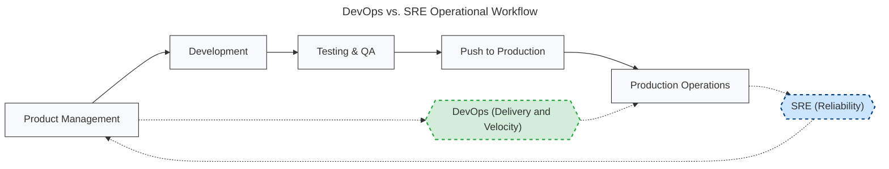

# sre
This Repo contains knowledge related to **S**ite **R**eliability **E**ngineering.

##### https://learning.oreilly.com/library/view/becoming-sre/9781492090540/

SRE is an engineering discipline devoted to helping organisations  
sustainably(sustainable operations practice) achieve  
the appropriate level(SLIs/SLOs) of reliability  
of their applications, products, services and systems  
while iterating at the speed demanded by the market place.

Reliability issues lead to the loss of  
health(Environment is constantly on fire, if on-call people are regularly woken up, if your staff always has to spend their time on work instead of their friends or family, there can be serious impact on health),  
hiring(People in this industry talk to each other. If it gets around that your workplace is one big “tire fire,” it will be very difficult to hire new people),  
revenue(the system that is down is critical for making money),  
reputation(People won’t want to use a service they find flaky and will happily switch to a competitor),  
time(deal with outage instead of planned work).

SRE is to reliability, 
as DevOps is to delivery(Delivering value to customers, delivering software, etc.).
**It is all about the direction of attention.**

SRE should be a conversation and not a doctrine.

Related books:

https://learning.oreilly.com/library/view/site-reliability-engineering/9781491929117/
https://www.usenix.org/conference/srecon14/technical-sessions/presentation/keys-sre
https://learning.oreilly.com/library/view/the-site-reliability/9781492029496/
https://learning.oreilly.com/library/view/seeking-sre/9781491978856/
https://learning.oreilly.com/library/view/implementing-service-level/9781492076803

